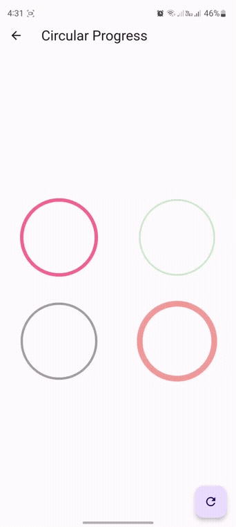
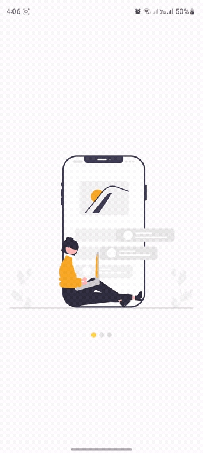
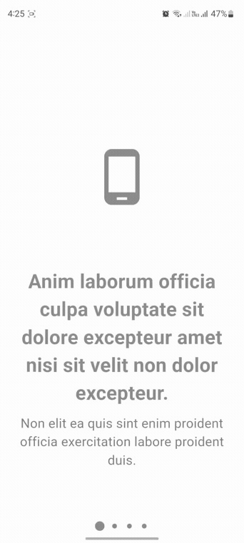

# WidgetsFlutter
_A collection of flutter widgets that can be modified for other applications within Flutter._

## built with 🛠️

* [Dart](https://dart.dev/) - Programming Language
* [Flutter](https://flutter.dev/) - framework Used
* [Visual Studio Code](https://code.visualstudio.com/) - Code Editor

## Demo
Demo of the application
### Circular Progress

### Slide Show

### Slide Show Horizontal

## Autores ✒️

* **Oscar Tapia** - *initial work* - [devRacso11](https://github.com/devRacso11)
* **Oscar Tapia** - *Documentation* - [devRacso11](https://github.com/devRacso11)
